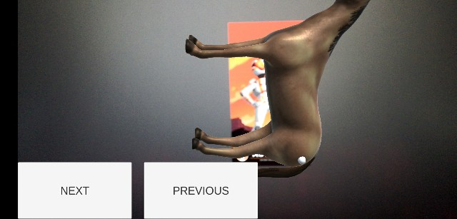
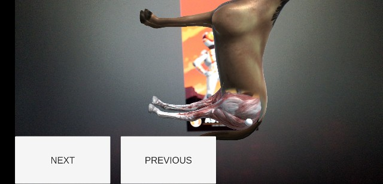
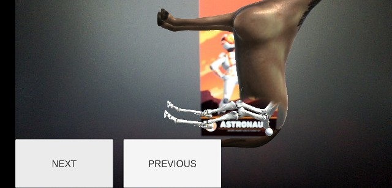

# AR Horse Anatomy
 AR Horse Anatomy is a simple augmented reality app that shows muscles and bones anatomy of the horse's haunch

## Table of contents
* [General info](#general-info)
* [Screenshots](#screenshots)
* [Technologies](#technologies)
* [Status](#status)
* [Inspiration](#inspiration)
* [Contact](#contact)

## General info
Application uses vuforia engine to capture a marker and shows horse 3d object, There are two sequential animations On click:

1. Next Button:

    - Horse to Muscle
    - Muscle to Bone

2. Previous Button:

    - Bone to Muscle
    - Muscle to Horse

## Screenshots

### Next Button

- #### Horse 3d Object
  

- #### Horse to Muscle
  
- #### Muscle to Bone
  

### Previous Button
- #### Horse 3d Object Bone
  

- #### Bone to Muscle
  
- #### Muscle to Horse
  

## Technologies
* Unity - 2018.3
* Vuforia - 8.0.10

## Status
Project is: for development purpose

## Inspiration
Project inspired by [The Ultimate Guide to Real World Applications with Unity](https://www.udemy.com/the-ultimate-guide-to-real-world-applications-with-unity/) udemy course

## Contact
Created by [Mohamed Abdelnaby Elattar](https://www.linkedin.com/in/maaelattar) - feel free to contact me!
